# Agent 智簽公文 - 產品需求文件 (PRD)

**版本：1.2**

**最後更新日期：2025-12-25**

**作者：Manus AI**

---

## 1. 產品概述與目標

### 1.1 產品簡介

Agent 智簽公文是一個專為國泰金控打造的 AI 智能公文生成系統。它旨在簡化採購簽呈的撰寫流程，讓使用者能以自然語言描述採購需求，系統即可自動生成符合國泰金控內部規範的專業簽呈文件。本系統完全在前端運行，無需後端伺服器，確保資料的隱私與安全。

### 1.2 產品目標

- **提升行政效率**：將傳統需要數小時甚至數天的簽呈撰寫時間縮短至幾分鐘，節省 99% 的時間。
- **降低錯誤率**：透過 AI 自動生成，確保簽呈格式的標準化與內容的完整性，減少人為錯誤。
- **優化使用者體驗**：提供直觀、易用的操作介面，讓不熟悉公文撰寫的使用者也能輕鬆上手。
- **確保資料安全**：所有使用者資料（包括 API Key、草稿、歷史紀錄）皆儲存在瀏覽器本地，不經過任何伺服器，保障企業資料安全。

### 1.3 目標使用者

本系統的主要使用者為國泰金控內部需要處理採購業務的各級員工，特別是：

- **行政人員**：負責日常辦公用品、設備的採購。
- **專案經理**：需要為專案採購特定的軟硬體或服務。
- **部門主管**：需要審批或發起部門內的採購需求。

---

## 2. 使用者角色與權限

本系統目前為單一使用者角色設計，所有使用者都擁有相同的功能權限。未來可考慮根據企業組織架構，增加不同層級的審批角色。

| 角色 | 權限描述 |
| :--- | :--- |
| **一般使用者** | - 登入/登出<br>- 輸入採購需求<br>- 上傳參考文件<br>- 生成採購簽呈<br>- 編輯、複製、下載、列印簽呈<br>- 管理草稿與歷史紀錄<br>- 設定 API Key 與模型 |


---

## 3. 核心業務流程

### 3.1 主要流程圖

```mermaid
graph TD
    A[使用者進入網站] --> B{是否已登入？};
    B -- 否 --> C[顯示 Hero 頁面];
    C --> D[點擊登入];
    B -- 是 --> E[進入主應用程式];
    D --> F[Google 登入授權];
    F --> E;
    E --> G[輸入採購需求];
    G --> H[上傳參考文件 (可選)];
    H --> I[點擊「生成簽呈」];
    I --> J[顯示載入動畫];
    J --> K{API 呼叫成功？};
    K -- 是 --> L[顯示生成結果];
    K -- 否 --> M[顯示錯誤訊息];
    L --> N[使用者操作];
    N --> O[編輯];
    N --> P[複製];
    N --> Q[下載 PDF];
    N --> R[列印];
    N --> S[儲存草稿];
    S --> E;
```

### 3.2 再次使用流程 (未登出情境)

此流程描述使用者在完成一次簽呈生成後，未登出帳號，經過一段時間後再次回到網站準備產生新簽呈的情境。

**業務邏輯：**

1.  **狀態保留**：網站會維持使用者上次的登入狀態。
2.  **介面重置**：為了提供一個乾淨的開始，系統會自動清空上次的輸入內容和生成結果。
3.  **資料保留**：上次生成的簽呈會自動存入「歷史紀錄」，使用者的輸入內容會存為「草稿」，確保資料不遺失。

**畫面呈現：**

-   **左側輸入區**：
    -   「草稿標題」和「採購需求描述」輸入框會被清空。
    -   「參考文件」區塊會恢復到初始的上傳狀態。
-   **右側結果區**：
    -   會顯示預設的「生成結果」歡迎畫面，而非上次的簽呈內容。

**流程圖：**

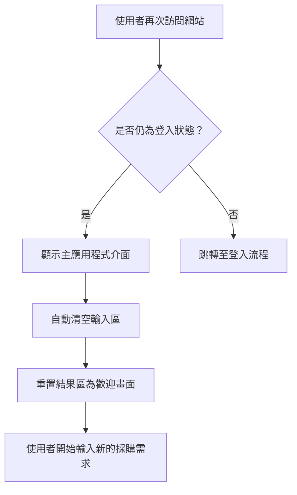

### 3.3 首次使用流程說明

1. **使用者登入**：
   - 未登入使用者會看到介紹網站功能的 Hero 頁面。
   - 使用者可透過 Google 帳號一鍵登入。
   - 登入成功後，進入主應用程式介面。

2. **需求輸入與文件上傳**：
   - 使用者在左側的「採購需求描述」輸入框中，以自然語言描述採購需求。
   - 使用者可以選擇性地在「參考文件」區塊上傳 PDF、Word、圖片等檔案，AI 會自動讀取並分析文件內容。

3. **AI 生成簽呈**：
   - 使用者點擊「生成簽呈」按鈕。
   - 系統會顯示載入動畫，並將使用者的輸入和文件內容傳送至 AI 模型。
   - AI 模型根據預設的 Prompt，生成符合國泰金控格式的採購簽呈。

4. **結果呈現與操作**：
   - 生成的簽呈會顯示在右側的「生成結果」區塊。
   - 使用者可以對結果進行編輯、複製、下載為 PDF 或直接列印。

5. **草稿與歷史紀錄**：
   - 系統會自動儲存使用者的輸入內容為草稿。
   - 使用者可以隨時在「歷史記錄」中查看過去生成的簽呈。

---

## 4. 功能需求規格

### 4.1 使用者認證

| 功能點 | 需求描述 |
| :--- | :--- |
| **Google 登入** | - 提供 Google 帳號快速登入功能。<br>- 登入後，在頁面右上角顯示使用者名稱和頭像。 |
| **登出** | - 使用者可隨時登出。<br>- 登出後返回 Hero 頁面。 |

### 4.2 需求輸入

| 功能點 | 需求描述 |
| :--- | :--- |
| **草稿標題** | - 提供選填的草稿標題輸入框。 |
| **需求描述** | - 提供多行文字輸入框，讓使用者以自然語言描述採購需求。<br>- 輸入框應有最少字數限制 (10個字)。 |
| **參考文件上傳** | - 支援拖曳或點擊上傳檔案。<br>- 支援 PDF, Word, TXT, JPG, PNG, GIF, WEBP 等格式。<br>- 檔案大小限制為 10MB。<br>- 上傳後，AI 會自動讀取文件內容。 |

### 4.3 AI 生成

| 功能點 | 需求描述 |
| :--- | :--- |
| **生成簽呈** | - 點擊按鈕後，呼叫 AI API 生成簽呈。<br>- 生成過程中顯示載入動畫和提示訊息。 |
| **錯誤處理** | - 若 API 呼叫失敗，顯示清晰的錯誤訊息。<br>- 錯誤訊息應包含錯誤原因和建議的解決方案。 |

### 4.4 結果操作

| 功能點 | 需求描述 |
| :--- | :--- |
| **編輯** | - 提供編輯模式，讓使用者可以修改生成的簽呈內容。 |
| **複製** | - 一鍵複製純文字內容至剪貼簿。 |
| **下載 PDF** | - 將生成的簽呈下載為 PDF 檔案。<br>- PDF 應包含內控浮水印。 |
| **列印** | - 開啟瀏覽器的列印對話框。 |

### 4.5 草稿與歷史紀錄

| 功能點 | 需求描述 |
| :--- | :--- |
| **自動儲存草稿** | - 每 30 秒自動儲存使用者的輸入內容。<br>- 顯示上次儲存時間。 |
| **手動儲存草稿** | - 提供手動儲存草稿的按鈕。 |
| **歷史紀錄** | - 在「歷史記錄」彈窗中顯示最近 50 筆生成的簽呈。<br>- 使用者可以查看、載入或刪除歷史紀錄。 |

### 4.6 設定

| 功能點 | 需求描述 |
| :--- | :--- |
| **API Key 設定** | - 使用者可以輸入並儲存自己的 OpenAI API Key。 |
| **模型選擇** | - 提供多種 AI 模型供使用者選擇 (GPT-4o Mini, GPT-3.5 Turbo, GPT-4o)。 |
| **自動儲存開關** | - 使用者可以開啟或關閉自動儲存草稿功能。 |
| **資料匯出/匯入** | - 使用者可以將所有資料（草稿、歷史紀錄、設定）匯出為 JSON 檔案。<br>- 使用者可以從 JSON 檔案匯入資料。 |
| **清除所有資料** | - 提供清除所有本地儲存資料的功能。 |


---

## 5. 系統架構與技術規格

### 5.1 技術架構

本系統為純前端應用程式，不依賴任何後端伺服器。所有運算和資料儲存都在使用者瀏覽器中完成。

| 技術 | 用途 | 載入方式 |
| :--- | :--- | :--- |
| **HTML5 / CSS3 / ES6+** | 應用程式基礎 | 原生 |
| **Tailwind CSS** | UI 框架 | CDN |
| **Lucide Icons** | 圖示庫 | CDN |
| **Marked.js** | Markdown 渲染 | CDN |
| **html2pdf.js** | PDF 生成 | CDN |
| **Google Identity Services** | 使用者認證 | CDN |

### 5.2 程式碼結構

JavaScript 程式碼採模組化設計，職責分離：

```text
js/
├── config.js    # 配置管理 (API 端點、模型選項)
├── storage.js   # 資料持久化 (localStorage 操作)
├── api.js       # API 呼叫 (LLM 請求)
├── ui.js        # UI 管理 (互動、渲染)
└── app.js       # 應用主邏輯 (事件處理、流程控制)
```

### 5.3 API 整合

- **OpenAI API**：用於文件內容分析和初步的簽呈生成。
- **AWS API Gateway**：用於呼叫更複雜的簽呈生成模型，並處理特定的公文格式要求。

---

## 6. 使用者介面設計

### 6.1 設計原則

- **簡潔專業**：介面設計應清晰、簡潔，符合企業級應用的專業形象。
- **響應式設計**：完美適應桌面、平板與行動裝置，確保跨裝置體驗一致。
- **互動性**：所有互動元素都有增強的 hover 效果和流暢的過渡動畫。

### 6.2 主要介面佈局

- **桌面版**：採用左右兩欄佈局，左側為輸入區，右側為結果顯示區。兩側內容區域高度應完美對齊。
- **行動版**：採用單欄佈局，將輸入區和結果區垂直堆疊。

---

## 7. 資料流程與狀態管理

### 7.1 畫面狀態轉換

右側結果區有四種主要狀態，其轉換邏輯如下：

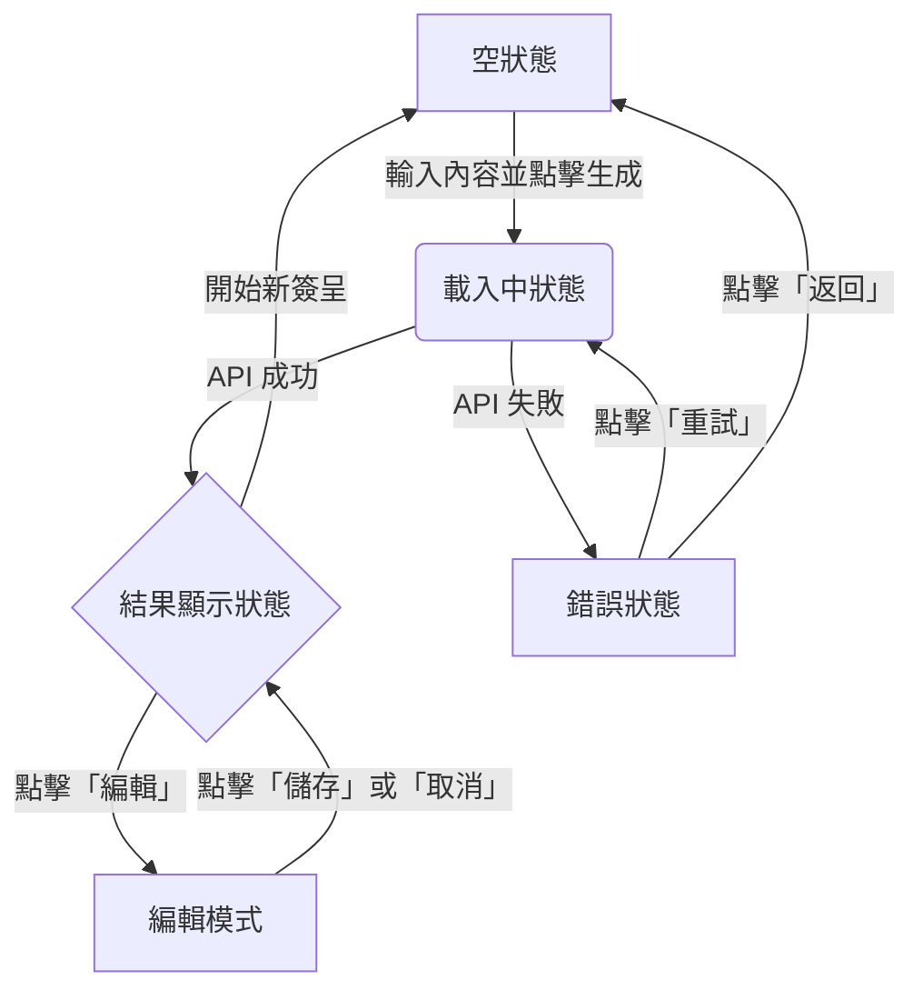

| 狀態 | 觸發條件 | 畫面呈現 |
| :--- | :--- | :--- |
| **空狀態** | - 首次進入<br>- 完成一次生成後開始新的簽呈 | 顯示歡迎訊息和使用提示 |
| **載入中狀態** | 點擊「生成簽呈」後 | 顯示載入動畫和提示文字 |
| **結果顯示狀態** | AI API 成功回傳結果 | 顯示生成的簽呈內容和操作按鈕 |
| **錯誤狀態** | AI API 呼叫失敗 | 顯示錯誤訊息和重試按鈕 |
| **編輯模式** | 點擊「編輯」按鈕 | 結果區變為可編輯的 textarea |


### 7.1 資料儲存

所有使用者資料都使用瀏覽器的 `localStorage` 進行儲存，包括：

- API Key
- 選擇的模型
- 草稿
- 歷史紀錄
- 自動儲存設定

### 7.2 狀態管理

應用程式的狀態主要由 `ProcurementApp` 類別管理，並透過 UI 模組 (`ui.js`) 更新介面顯示。

---

## 8. 安全性與合規要求

### 8.1 資料安全

- **本地儲存**：所有敏感資料（如 API Key）都儲存在使用者本地，不會上傳至任何伺服器。
- **HTTPS**：網站應使用 HTTPS 加密傳輸，確保與 AI API 的通訊安全。

### 8.2 合規要求

- **國泰金控公文格式**：生成的簽呈必須嚴格遵守國泰金控的內部公文格式規範。
- **內控浮水印**：下載的 PDF 檔案應自動加入內控浮水印，以符合企業文件管理要求。


---

## 9. 詳細業務流程說明

### 9.1 使用者認證流程

#### 9.1.1 登入流程

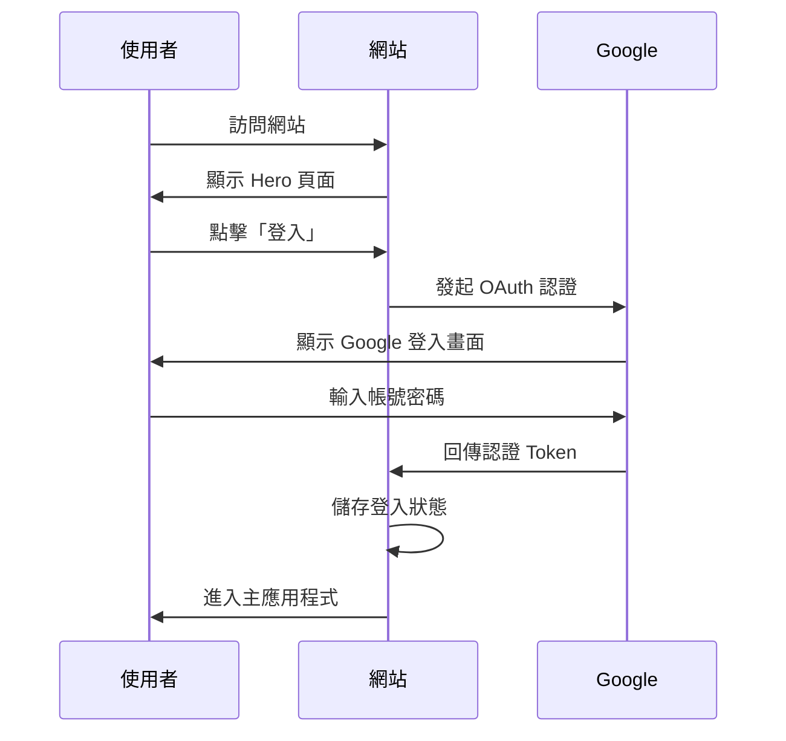

#### 9.1.2 登出流程

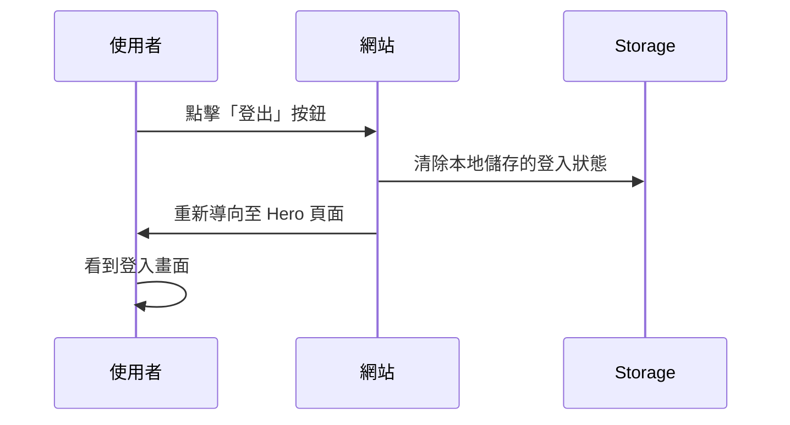


### 9.2 連續生成多份簽呈流程

此流程描述使用者在生成一份簽呈後，不清空介面，直接修改輸入內容以生成下一份簽呈的情境。

**業務邏輯：**

1.  **保留輸入內容**：使用者可以選擇不清空輸入區，直接在現有基礎上修改「採購需求描述」。
2.  **重新生成**：再次點擊「生成簽呈」按鈕，系統會使用新的輸入內容呼叫 AI API。
3.  **更新歷史紀錄**：新的生成結果會被存為一筆獨立的歷史紀錄。

**畫面呈現：**

-   **左側輸入區**：使用者可以自由編輯內容。
-   **右側結果區**：在生成過程中會顯示載入動畫，完成後更新為新的簽呈內容。

**流程圖：**

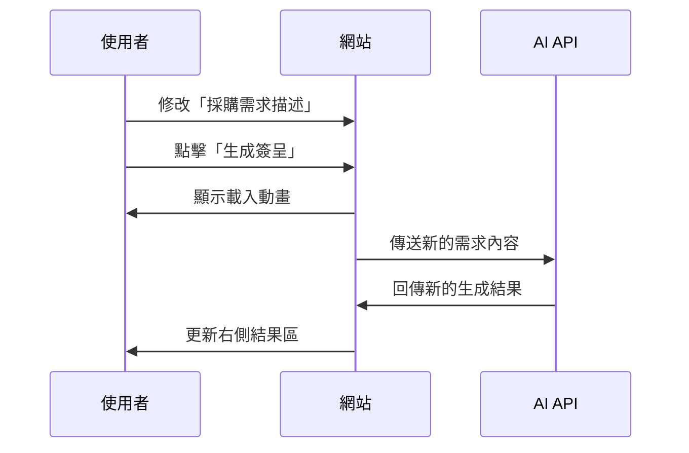
```
```
### 9.3 首次簽呈生成流程

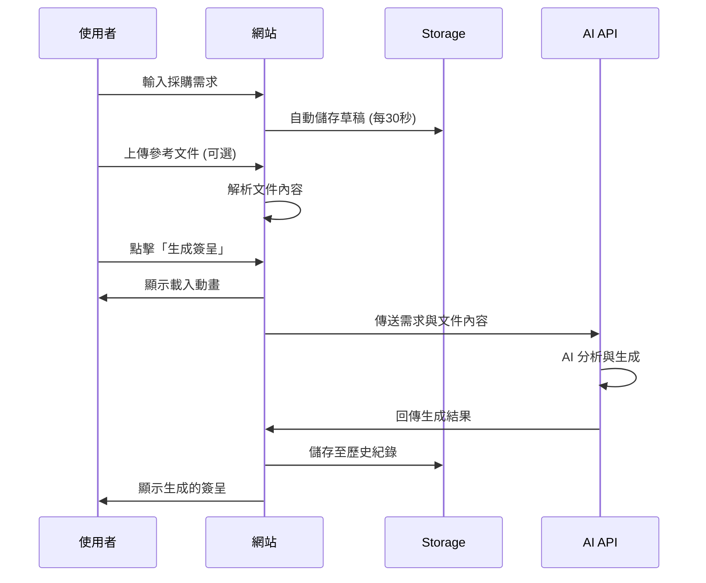

### 9.4 歷史紀錄操作流程

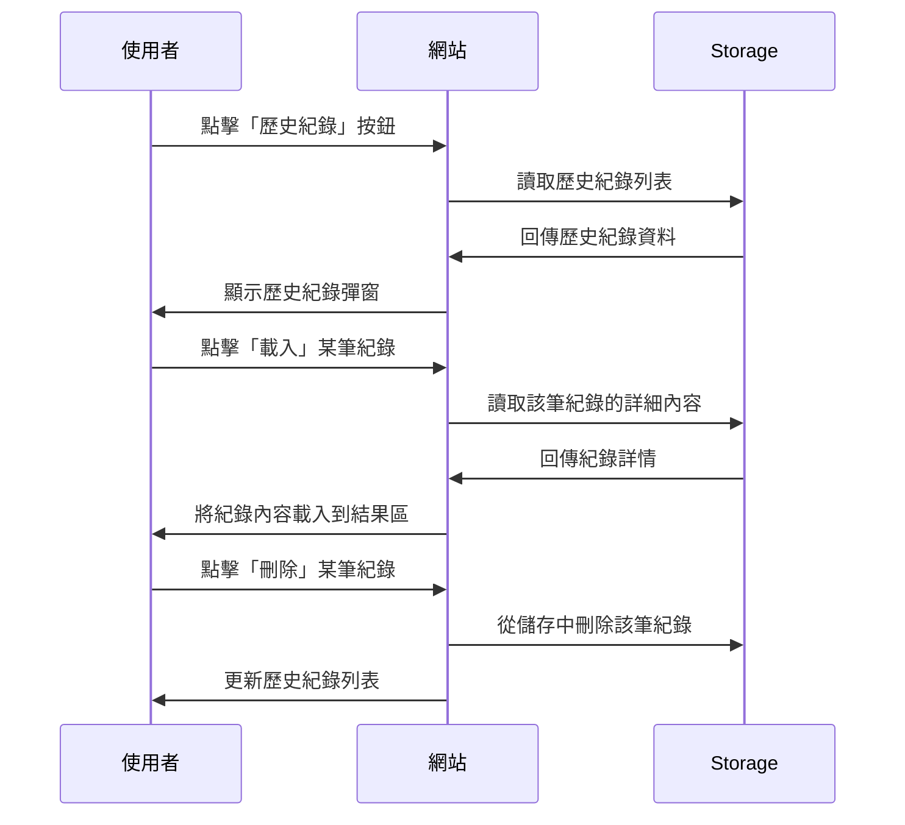

### 9.5 草稿管理流程

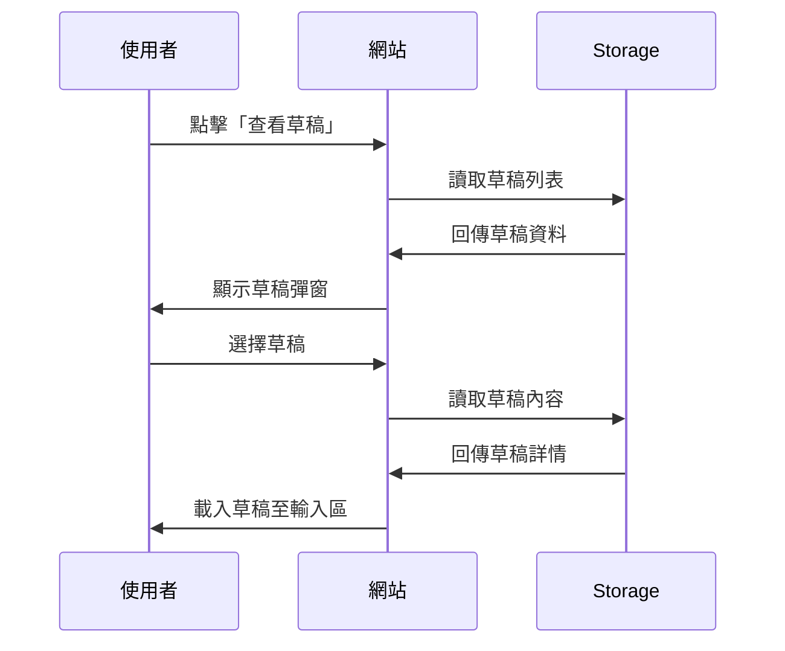

### 9.6 設定功能操作流程

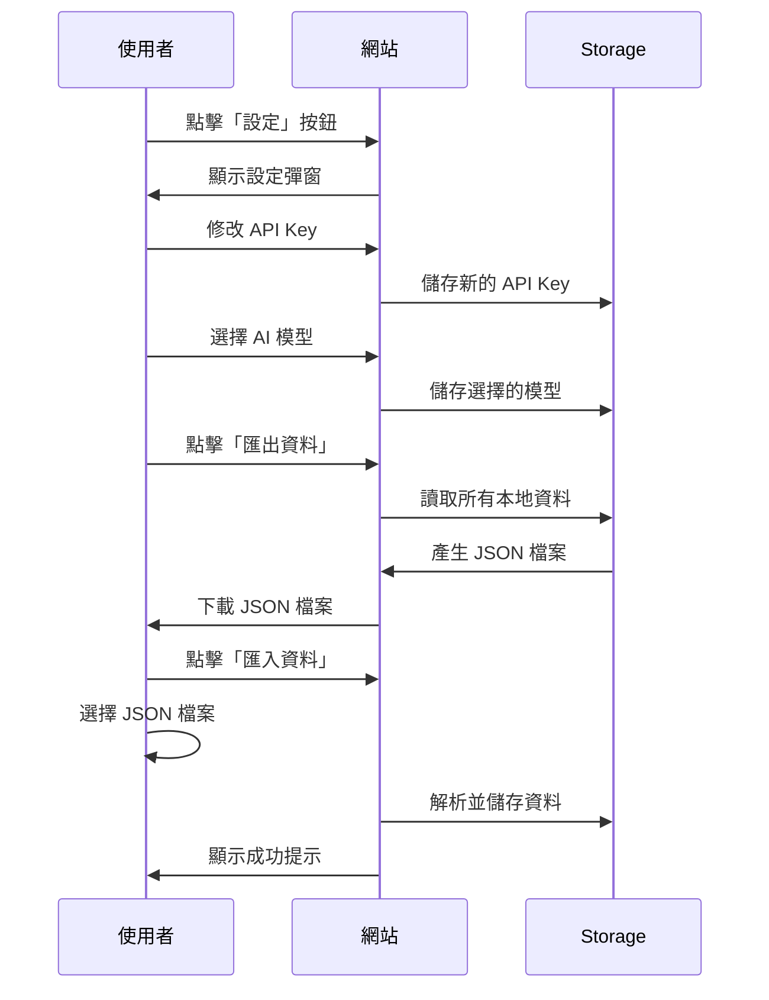

### 9.8 編輯模式操作流程

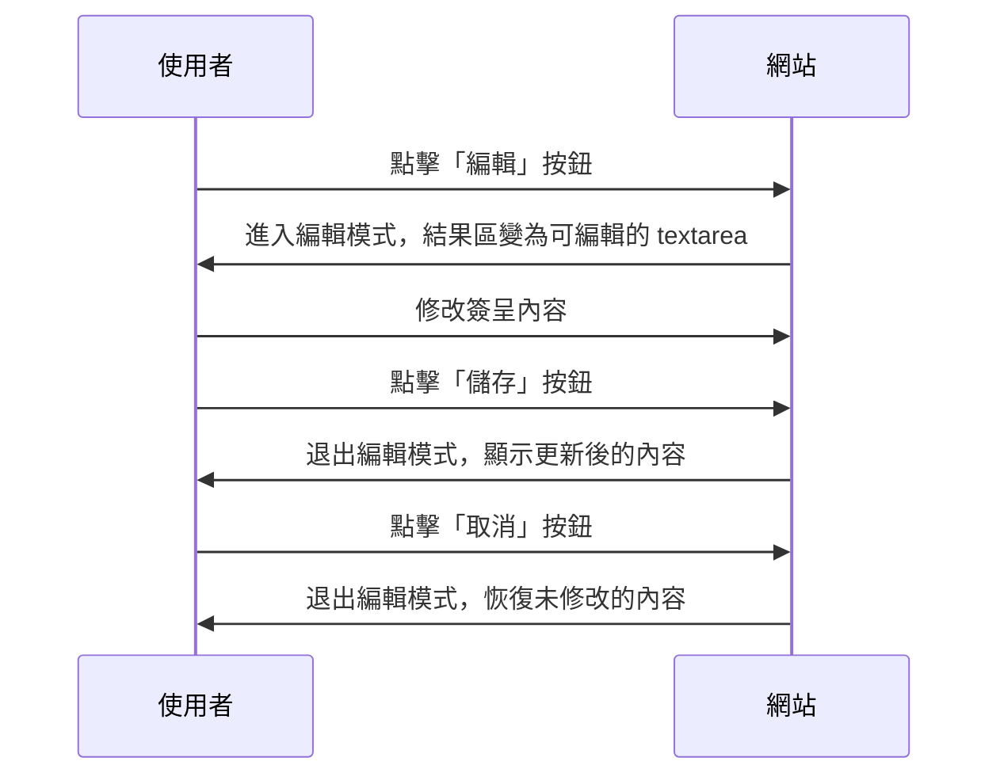

### 9.9 結果操作流程

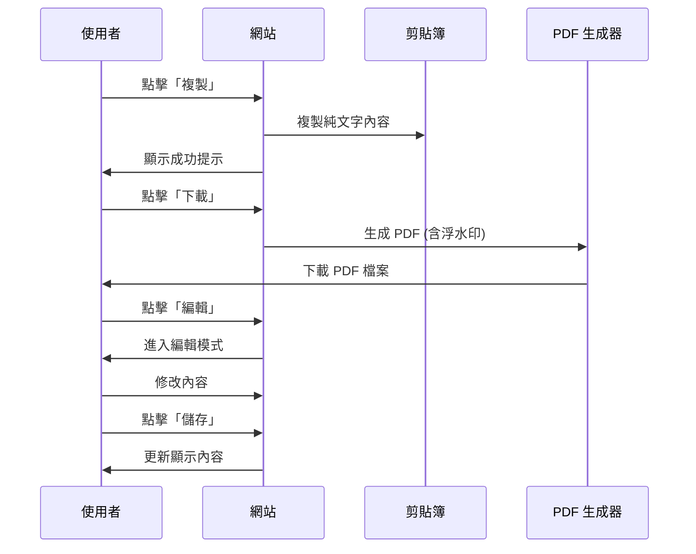

---

## 10. 錯誤處理與訊息

### 10.1 錯誤代碼分類

| 類別 | 代碼前綴 | 說明 |
| :--- | :--- | :--- |
| API 錯誤 | `API_` | 與 AI API 通訊相關的錯誤 |
| 網路錯誤 | `NET_` | 網路連線相關的錯誤 |
| 檔案錯誤 | `FILE_` | 檔案上傳與處理相關的錯誤 |
| 認證錯誤 | `AUTH_` | 使用者認證相關的錯誤 |
| 輸入錯誤 | `INPUT_` | 使用者輸入驗證相關的錯誤 |
| UI 錯誤 | `UI_` | 使用者介面操作相關的錯誤 |

### 10.2 常見錯誤訊息

| 錯誤代碼 | 標題 | 訊息 |
| :--- | :--- | :--- |
| `API_401` | API Key 無效 | 請在設定中更新 API Key。 |
| `API_429` | 請求過於頻繁 | 請稍等幾分鐘後再試。 |
| `API_500` | AI 服務暫時無法使用 | 請稍後再試，或聯絡技術支援。 |
| `NET_FAILED_FETCH` | 網路連線失敗 | 請檢查網路連線後再試。 |
| `FILE_TOO_LARGE` | 檔案過大 | 檔案大小不能超過 10MB。 |
| `INPUT_EMPTY_DESCRIPTION` | 輸入不完整 | 請輸入採購需求描述。 |

---

## 11. 未來規劃

### 11.1 短期規劃 (1-3 個月)

- **多語言支援**：增加英文介面，方便國際業務使用。
- **範本功能**：提供常用採購類型的範本，讓使用者可以快速選擇。
- **批次生成**：支援一次輸入多個採購需求，批次生成簽呈。

### 11.2 中期規劃 (3-6 個月)

- **審批流程整合**：與國泰金控內部審批系統對接，實現線上審批。
- **團隊協作**：支援多人協作編輯同一份簽呈。
- **進階分析**：提供採購數據分析和報表功能。

### 11.3 長期規劃 (6-12 個月)

- **AI 學習優化**：根據使用者的修改紀錄，持續優化 AI 模型的生成品質。
- **跨部門整合**：擴展至其他類型的公文生成，如請假單、出差報告等。
- **行動應用程式**：開發原生 iOS 和 Android 應用程式。

---

## 附錄 A：名詞解釋

| 名詞 | 解釋 |
| :--- | :--- |
| **簽呈** | 一種正式的公文格式，用於向上級報告事項或請求核准。 |
| **API Key** | 用於驗證身份並授權存取 AI 服務的金鑰。 |
| **Prompt** | 傳送給 AI 模型的指令或問題，用於引導 AI 生成特定內容。 |
| **草稿** | 使用者尚未完成或提交的輸入內容，系統會自動儲存。 |
| **歷史紀錄** | 使用者過去生成的簽呈記錄，可供查閱和重複使用。 |

---

## 附錄 B：相關文件

| 文件 | 說明 |
| :--- | :--- |
| [README.md](../README.md) | 專案總覽、功能介紹與快速開始。 |
| [CHANGELOG.md](../CHANGELOG.md) | 變更記錄：主要功能更新與修復歷史。 |
| [ERROR_CODES.md](ERROR_CODES.md) | 錯誤代碼文件：詳細的錯誤代碼說明。 |
| [DEPLOYMENT.md](../DEPLOYMENT.md) | 部署指南：如何將網站部署到公開網路。 |
| [docs/README.md](README.md) | 文件索引：所有技術文件的入口。 |

---

**文件結束**
